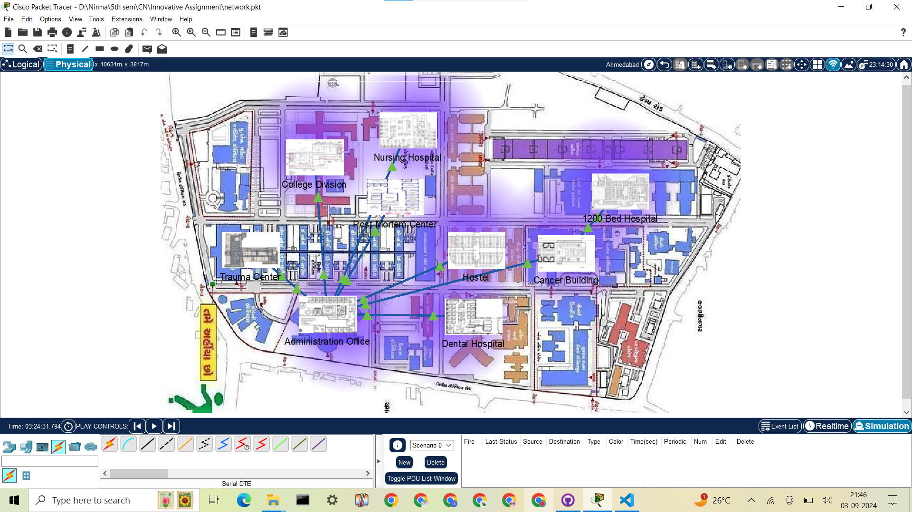
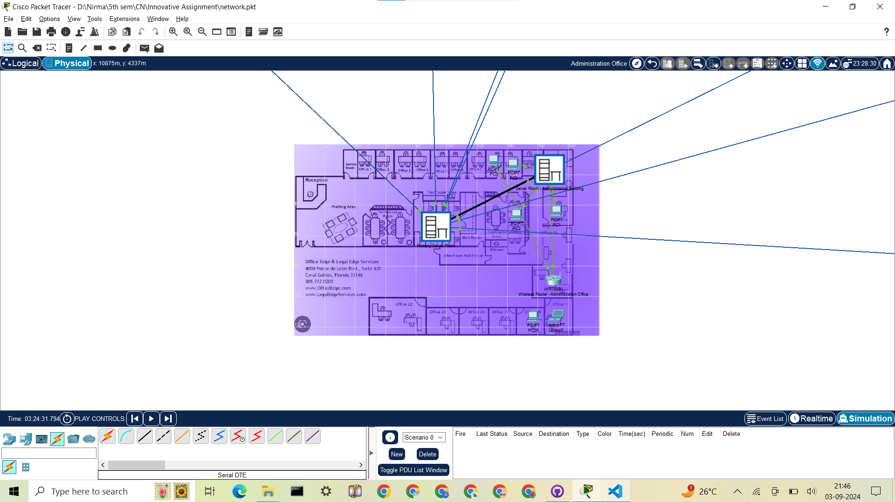
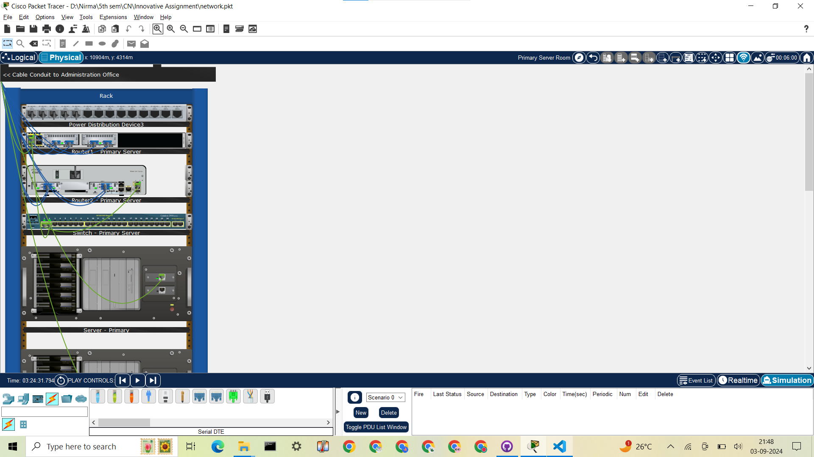
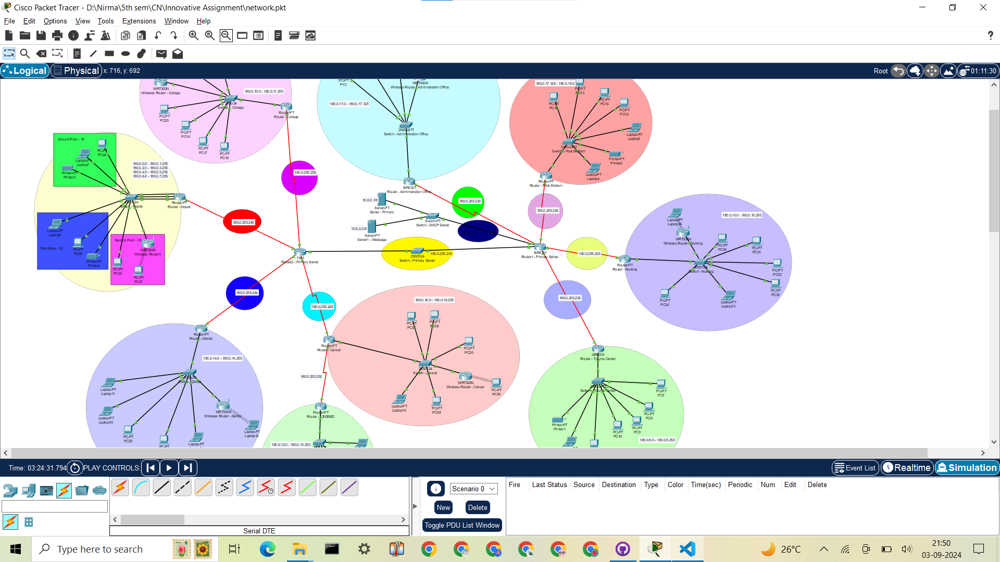

# Hospital Network Management
A hospital network has been setup using cisco packet tracer and using the concepts of computer networks where in the physical and logical maps have been made. Physical connections include inter-building and intra-building connections. Logical connections include subnetting, DHCP and static IP assignment, HTTP and DHCP server setup, usage of router and switch and setup of wireless network as well. The following snapshots show the physical and logical connections of the established network.
The main hospital map is below.

This is the Administration office map.

This is the primary server room setup.

This is the logical setup of the entire network.

This repository acts a submission for major innovative assignment for the course - Computer Networks (DSA - 2CS502) while pursuing B.Tech CSE at Nirma University.